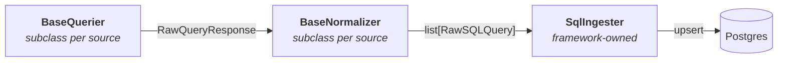

# data-collectors

Python framework for pulling data from external APIs into our Postgres
database. Each data source is a small pair of subclasses — one
`BaseQuerier`, one `BaseNormalizer` — and the framework handles
persistence, conflict resolution, and pagination.

## The pattern



Three classes, wired by `run()`:

- **`BaseQuerier`** (abstract) — subclasses implement `get_page(n)`;
  the framework's `fetch()` generator pages through the API and yields
  one `RawQueryResponse` per page, sleeping for `page_delay_seconds`
  between calls.
- **`BaseNormalizer`** (abstract) — subclasses implement
  `normalize(response)`, mapping a `RawQueryResponse` to a list of
  `RawSQLQuery` records and setting a `dedup_key` (column names) that
  the ingester uses to resolve duplicates.
- **`SqlIngester`** (concrete) — groups records by `dedup_key`, applies
  per-column merge rules, and upserts. It knows nothing source-specific.

> **Why `SqlIngester` and not just `Ingester`?** We may add other
> backends later (a dry-run logger, a JSON-to-disk ingester for local
> dev). The SQL-specific name leaves room for siblings without a rename.

## How to add a new data-collector

Create one file at `sources/<your_source>.py` with a Querier + Normalizer
pair:

```python
from framework import (
    BaseQuerier, BaseNormalizer, RawQueryResponse, RawSQLQuery,
)

class MySourceQuerier(BaseQuerier):
    source = "my_source"
    page_delay_seconds = 1.0

    def get_page(self, page: int) -> RawQueryResponse | None:
        # Return None to stop; otherwise return the envelope for this page.
        ...

class MySourceNormalizer(BaseNormalizer):
    def normalize(self, response: RawQueryResponse) -> list[RawSQLQuery]:
        # Map the raw payload into per-row RawSQLQuery objects,
        # setting dedup_key to the column names that uniquely
        # identify each row (typically ("source", "source_id")).
        ...
```

Then write a tiny entrypoint that wires the three together:

```python
from framework import run, SqlIngester
from sources.my_source import MySourceQuerier, MySourceNormalizer
import psycopg

with psycopg.connect(...) as conn:
    run(MySourceQuerier(), MySourceNormalizer(), SqlIngester(conn))
```

See [`sources/osm_repair.py`](sources/osm_repair.py) for a worked
example against the OpenStreetMap Overpass API.

Each source is later deployed as its own Kubernetes CronJob so that
scheduling, failures, and retries stay isolated per source.
