# Data Collectors

```mermaid
flowchart LR
    FetchResponse["FetchResponse<br/>(DTO)"]
    SQLQuery["SQLQuery<br/>(DTO)"]

    fetch["BaseJob<br/>fetch()"]
    normalize["BaseJob<br/>normalize()"]
    Ingester["Ingester<br/>write()"]

    fetch -->|"list[FetchResponse]"| FetchResponse
    FetchResponse -->|"list[FetchResponse]"| normalize
    normalize -->|"list[SQLQuery]"| SQLQuery
    SQLQuery -->|"list[SQLQuery]"| Ingester

    style FetchResponse fill:#f0e68c,stroke:#b8a800,color:#000
    style SQLQuery fill:#f0e68c,stroke:#b8a800,color:#000
    style fetch fill:#a8d8ea,stroke:#2a7fa5,color:#000
    style normalize fill:#a8d8ea,stroke:#2a7fa5,color:#000
    style Ingester fill:#a8d8ea,stroke:#2a7fa5,color:#000
```

Each job fetches data from one source and normalizes it into database records.

## Adding a job

1. Copy `jobs/example/` into a new folder under `jobs/`
2. Implement `fetch()` — make however many requests you need, return one `FetchResponse` per request
3. Implement `normalize()` — transform the responses into `SQLQuery` records
